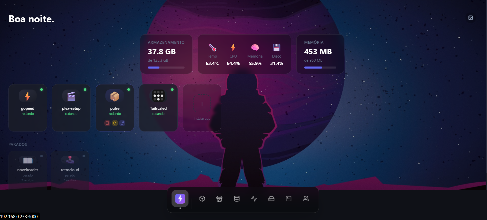
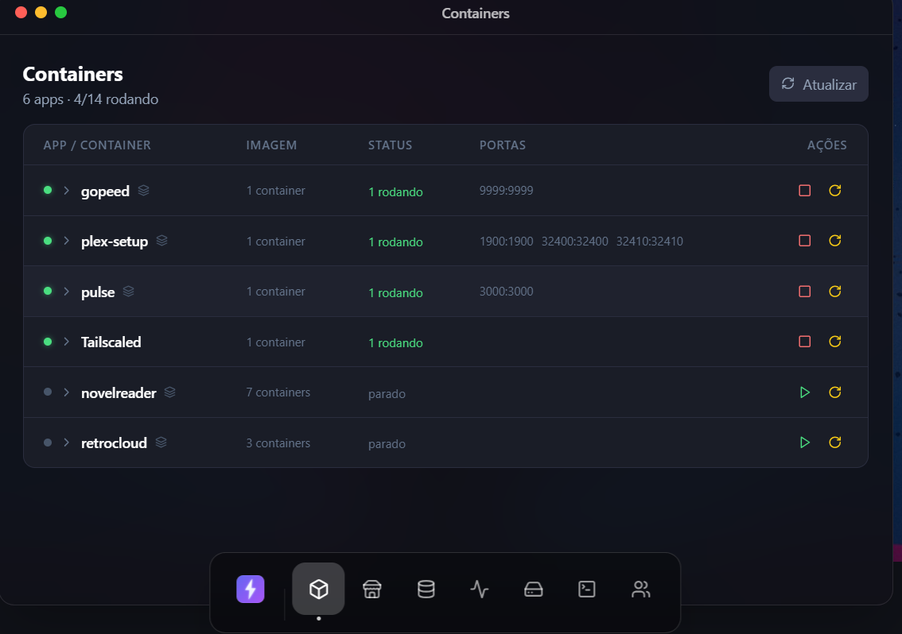
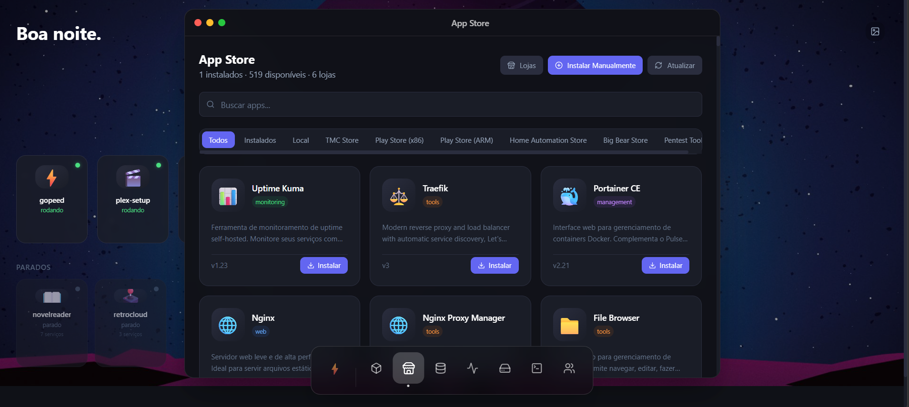
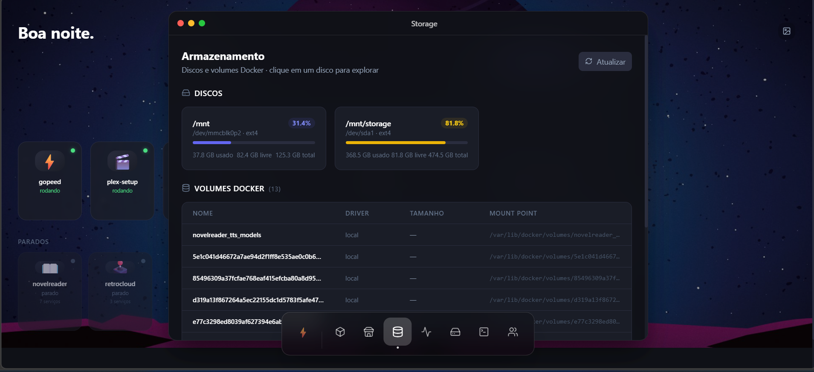
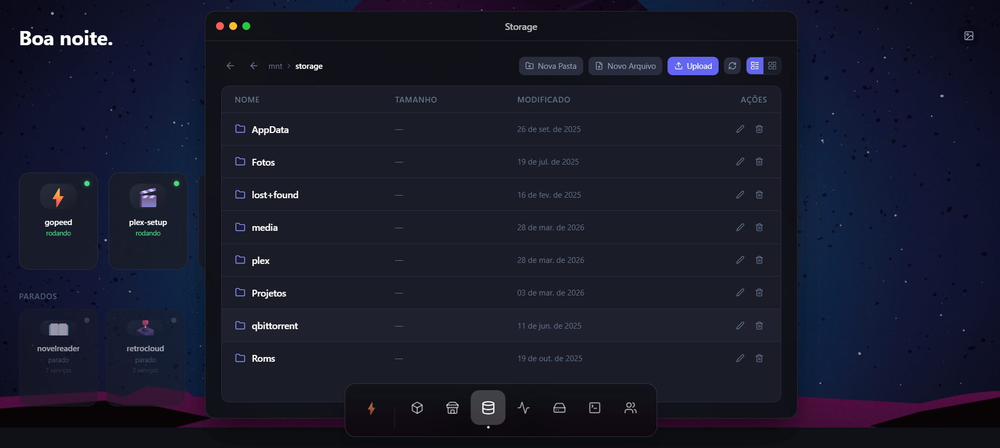
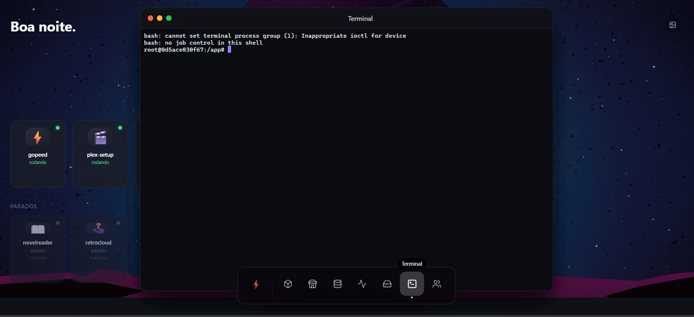
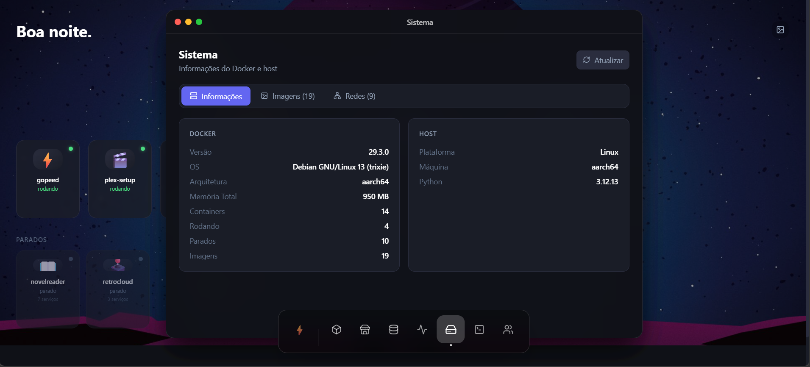
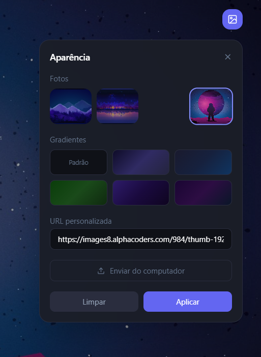

<div align="center">


# Pulse

**Self-hosted Docker container manager — built for Raspberry Pi and ARM servers**

[](https://python.org)
[](https://fastapi.tiangolo.com)
[](https://react.dev)
[](https://docker.com)
[](LICENSE)

A beautiful, lightweight alternative to Portainer and CasaOS — with a macOS-inspired windowed interface, wallpaper support, integrated terminal, multi-store App Store and multi-user access control.



</div>

---

## Screenshots

<table>
<tr>
<td width="50%">

**Containers**



</td>
<td width="50%">

**App Store**



</td>
</tr>
<tr>
<td width="50%">

**Storage**



</td>
</tr>
<tr>
<td width="50%">

**File Browser**



</td>
<td width="50%">

**Terminal**



</td>
</tr>
<tr>
<td width="50%">

**Sistema**



</td>
<td width="50%">

**Aparência**



</td>
</tr>
</table>

---

## Features

### Interface
- **Windowed UI** — pages open as draggable, resizable floating windows (macOS-style)
- **Bottom dock** — glassmorphism icon dock, centered, hover tooltips
- **Custom wallpapers** — photo presets, gradient themes, custom URL or upload from PC
- **Display name** — personalized greeting (`Bom dia, João!`)

### Containers
- **Dashboard** — live tiles with official icons, status indicators, one-click start/stop/restart
- **Container side drawer** — click any container to open a panel with:
  - **Logs** — last 200 lines + live stream toggle
  - **Config** — edit env vars, restart policy, volumes and ports
  - **Terminal** — `docker exec` shell directly inside the container
  - **Local Domain** — generate `/etc/hosts` entry for `.local` access
- **Grouped view** — Docker Compose stacks shown as expandable groups
- **Navigate from dashboard** — click the arrow on a tile to go straight to that group

### App Store
- **519+ apps** across 6 stores (expandable)
- **Multi-store** — enable/disable stores, add custom zip store URLs
- **Edit before install** — full docker-compose editor before deploying
- **Official icons** — app icons preserved from store metadata
- **Clean container names** — `pulse_tailscale` not `pulse_cp0204-play-arm-tailscale`

| Store | Type |
|-------|------|
| TMC Store | Local templates (Nginx, Traefik, Portainer…) |
| Play Store (x86) | Community zip store |
| Play Store (ARM) | Community zip store |
| Home Automation | Home Assistant ecosystem |
| Big Bear Store | Curated self-hosted apps |
| Pentest Tools | Security & network tools |

### System
- **Real-time metrics** — CPU, RAM, temperature, disk (WebSocket live)
- **System info** — Docker version, host arch, image list, network list
- **Storage** — disk usage, Docker volumes, full file browser (upload/download/rename/delete)
- **Terminal** — integrated PTY bash shell inside the Pulse container
- **Docker exec** — shell terminal inside any running container

### Security & Users
- **Multi-user RBAC** — admin and viewer roles
- **Admin** — full access: create, modify, delete containers, apps, users
- **Viewer** — read-only: see containers, logs, metrics, files
- **Change password** — any user can change their own password
- **Logout** — session management from the Users page

| Auth mode | How to enable |
|-----------|--------------|
| Multi-user | First access creates admin account |
| API Key | Set `PULSE_API_KEY` env var |
| No auth | Leave `PULSE_API_KEY` empty (dev only) |

---

## Quick Start

```bash
git clone https://github.com/jhonatasortega/Pulse.git
cd Pulse
docker compose up -d --build
```

Open `http://<your-server-ip>:3000` — on first access you'll create your admin account.

---

## Deploy to Raspberry Pi

```bash
# Usage: ./deploy.sh user@host [remote_dir]
./deploy.sh pi@192.168.0.100
./deploy.sh pi@192.168.0.100 /home/pi/pulse
```

---

## Configuration

### docker-compose.yml

```yaml
services:
  pulse-backend:
    build: .
    container_name: pulse_backend
    ports:
      - "3000:3000"
    volumes:
      - ./data:/app/data
      - /var/run/docker.sock:/var/run/docker.sock
      - /mnt:/mnt:rshared
      - /media:/media:rshared
      - /home:/home:rshared
    environment:
      - PULSE_API_KEY=${PULSE_API_KEY:-}
    restart: unless-stopped
```

### Environment Variables

| Variable | Default | Description |
|----------|---------|-------------|
| `PULSE_API_KEY` | *(empty)* | Single-user API key. Leave empty to use multi-user login |
| `PULSE_DATA_DIR` | `/app/data` | Data directory for users, app state, configs |

---

## Stack

| Layer | Technology |
|-------|-----------|
| Backend | Python 3.12, FastAPI, Uvicorn |
| Frontend | React 18, Vite, Tailwind CSS |
| Terminal | xterm.js + PTY (`subprocess` + `pty.openpty`) |
| Docker API | docker-py (singleton client) |
| Auth | SHA-256 + salt, session/localStorage |
| Serving | FastAPI StaticFiles (SPA fallback) |

---

## Project Structure

```
Pulse/
├── core/                     # FastAPI backend
│   ├── main.py               # Entry point, auth endpoints, lifespan
│   ├── api/
│   │   ├── auth.py           # Auth dependency (HTTP + WebSocket)
│   │   └── routes/           # containers, groups, apps, terminal, users, stores…
│   └── services/             # docker_service, app_service, store_service, user_service…
├── frontend/
│   └── src/
│       ├── App.jsx            # Windowed UI + bottom dock
│       ├── pages/             # Dashboard, Containers, AppStore, Terminal, Users…
│       └── components/        # AuthGate (login / first-access setup)
├── apps/templates/            # Built-in app templates (YAML)
├── docs/screenshots/          # UI screenshots
├── docker/entrypoint.sh       # Colored ASCII startup banner
├── Dockerfile
└── docker-compose.yml
```

---

## Architecture Notes

- **WebSocket auth** — browsers can't send custom headers on WS upgrades; credentials are appended as query params and read via `starlette.requests.HTTPConnection`
- **Docker client** — singleton with auto-reconnect for fast repeated API calls
- **Store pre-warm** — store cache is populated in background at startup so App Store loads instantly
- **Container naming** — apps installed from stores use `pulse_{name_slug}` (e.g. `pulse_tailscale`)
- **Modal containment** — modals use `position: absolute` inside floating windows (not `fixed`) to stay clipped within the window bounds

---

<div align="center">
Made with ⚡ for self-hosters who want something beautiful
</div>
